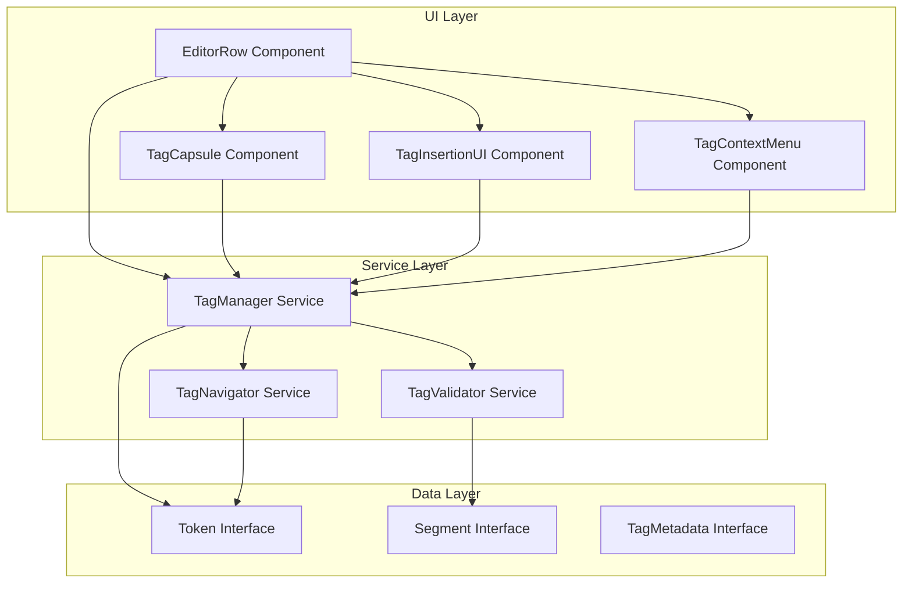

# Design Document: CAT Tool Tag System Refactor

## Overview

This design document describes the refactored tag system for a Computer-Assisted Translation (CAT) tool editor. The refactor transforms the current basic tag implementation into a professional-grade system matching industry standards set by tools like Phrase, memoQ, and Trados.

The refactored system introduces:
- **Enhanced visual design** with clear type differentiation and validation feedback
- **Rich interaction model** supporting keyboard navigation, drag-and-drop, and context menus
- **Real-time validation** with auto-fix suggestions
- **Comprehensive accessibility** for keyboard-only and screen reader users
- **Modular architecture** separating concerns for maintainability

The design maintains backward compatibility with the existing Token-based data model while extending it with new metadata and capabilities.

## Architecture

### High-Level Architecture



### Component Responsibilities

**UI Layer:**
- **EditorRow**: Orchestrates segment editing, manages active state, coordinates tag operations
- **TagCapsule**: Renders individual tags with appropriate styling, handles tag-specific interactions
- **TagInsertionUI**: Provides visual interface for inserting source tags into target
- **TagContextMenu**: Displays context menu with tag-specific actions

**Service Layer:**
- **TagManager**: Central service for tag operations (insert, delete, move, copy)
- **TagValidator**: Validates tag integrity, generates QA issues, provides auto-fix suggestions
- **TagNavigator**: Handles keyboard navigation between tags, focus management

**Data Layer:**
- **Token**: Core data structure representing text and tag elements
- **Segment**: Container for source/target tokens with metadata
- **TagMetadata**: Extended metadata for tags (pairing, validation state, position)

### Design Patterns

1. **Service Pattern**: Tag operations centralized in services for reusability and testing
2. **Component Composition**: Small, focused components composed into larger features
3. **Observer Pattern**: Services emit events for UI updates (validation changes, focus changes)
4. **Strategy Pattern**: Different tag types (paired, standalone) use different rendering strategies
5. **Command Pattern**: Tag operations (insert, delete, move) implemented as reversible commands

## Components and Interfaces

### TagCapsule Component

The TagCapsule component renders individual tags with appropriate visual styling and interaction handlers.

**Props:**
```typescript
interface TagCapsuleProps {
  token: Token;
  index: number;
  isSource: boolean;
  isSelected: boolean;
  validationState?: 'valid' | 'error' | 'warning';
  onSelect: (index: number) => void;
  onDelete: (index: number) => void;
  onContextMenu: (index: number, event: React.MouseEvent) => void;
  onDragStart: (index: number, event: React.DragEvent) => void;
  onDragEnd: (index: number, event: React.DragEvent) => void;
}
```

**Rendering Logic:**
```typescript
function TagCapsule({ token, index, isSource, isSelected, validationState, ... }: TagCapsuleProps) {
  const tagInfo = getTagDisplayInfo(token.content, index);
  
  // Base styles
  const baseStyles = "inline-flex items-center px-1 py-0.5 mx-0.5 text-[10px] font-bold border";
  
  // Color scheme based on source/target
  const colorStyles = isSource 
    ? "bg-blue-100 text-blue-700 border-blue-200"
    : "bg-blue-500 text-white border-blue-600";
  
  // Validation state styling
  const validationStyles = 
    validationState === 'error' ? "ring-2 ring-red-500" :
    validationState === 'warning' ? "ring-2 ring-yellow-400" :
    "";
  
  // Shape based on tag type
  const shapeStyles = 
    tagInfo.type === 'paired-start' ? "rounded-l" :
    tagInfo.type === 'paired-end' ? "rounded-r" :
    "rounded";
  
  // Selection styling
  const selectionStyles = isSelected ? "ring-2 ring-blue-400" : "";
  
  return (
    <span
      className={`${baseStyles} ${colorStyles} ${validationStyles} ${shapeStyles} ${selectionStyles}`}
      contentEditable={false}
      data-tag={token.content}
      data-tag-index={index}
      data-tag-type={tagInfo.type}
      title={token.content}
      draggable
      onClick={(e) => { e.stopPropagation(); onSelect(index); }}
      onContextMenu={(e) => { e.preventDefault(); onContextMenu(index, e); }}
      onDragStart={(e) => onDragStart(index, e)}
      onDragEnd={(e) => onDragEnd(index, e)}
      role="button"
      tabIndex={0}
      aria-label={`Tag ${index + 1}: ${token.content}`}
    >
      {tagInfo.display}
    </span>
  );
}
```

### TagInsertionUI Component

Provides a visual interface for inserting source tags into the target segment.

**Props:**
```typescript
interface TagInsertionUIProps {
  sourceTags: Token[];
  onInsertTag: (tagIndex: number) => void;
  onInsertAllTags: () => void;
  isVisible: boolean;
}
```

**UI Structure:**
```typescript
function TagInsertionUI({ sourceTags, onInsertTag, onInsertAllTags, isVisible }: TagInsertionUIProps) {
  if (!isVisible || sourceTags.length === 0) return null;
  
  return (
    <div className="absolute top-full left-0 mt-1 bg-white border border-gray-200 rounded-md shadow-lg z-10">
      <div className="p-2 border-b border-gray-100">
        <button
          onClick={onInsertAllTags}
          className="w-full px-3 py-1.5 text-xs font-medium text-blue-600 hover:bg-blue-50 rounded"
        >
          Insert All Tags
        </button>
      </div>
      <div className="max-h-48 overflow-y-auto">
        {sourceTags.map((tag, index) => {
          const tagInfo = getTagDisplayInfo(tag.content, index);
          return (
            <button
              key={index}
              onClick={() => onInsertTag(index)}
              className="w-full px-3 py-2 text-left hover:bg-gray-50 flex items-center gap-2"
            >
              <span className="inline-flex items-center px-1.5 py-0.5 text-[10px] font-bold rounded bg-blue-100 text-blue-700 border border-blue-200">
                {tagInfo.display}
              </span>
              <span className="text-xs text-gray-600 truncate">{tag.content}</span>
            </button>
          );
        })}
      </div>
    </div>
  );
}
```

### TagContextMenu Component

Displays a context menu with tag-specific actions.

**Props:**
```typescript
interface TagContextMenuProps {
  tag: Token;
  tagIndex: number;
  position: { x: number; y: number };
  pairedTagIndex?: number;
  onClose: () => void;
  onViewContent: () => void;
  onCopyTag: () => void;
  onDeleteTag: () => void;
  onJumpToPair?: () => void;
}
```

**Menu Structure:**
```typescript
function TagContextMenu({ tag, tagIndex, position, pairedTagIndex, onClose, ... }: TagContextMenuProps) {
  return (
    <div
      className="fixed bg-white border border-gray-200 rounded-md shadow-lg z-50 py-1"
      style={{ left: position.x, top: position.y }}
    >
      <button onClick={onViewContent} className="w-full px-4 py-2 text-left text-sm hover:bg-gray-50">
        View Full Content
      </button>
      <button onClick={onCopyTag} className="w-full px-4 py-2 text-left text-sm hover:bg-gray-50">
        Copy Tag
      </button>
      <button onClick={onDeleteTag} className="w-full px-4 py-2 text-left text-sm hover:bg-gray-50 text-red-600">
        Delete Tag
      </button>
      {pairedTagIndex !== undefined && (
        <button onClick={onJumpToPair} className="w-full px-4 py-2 text-left text-sm hover:bg-gray-50">
          Jump to Paired Tag
        </button>
      )}
    </div>
  );
}
```

### TagManager Service

Central service for tag operations.

**Interface:**
```typescript
class TagManager {
  // Tag insertion
  insertTag(targetTokens: Token[], tagContent: string, cursorPosition: number): Token[];
  insertAllTags(targetTokens: Token[], sourceTags: Token[], cursorPosition: number): Token[];
  
  // Tag deletion
  deleteTag(targetTokens: Token[], tagIndex: number): Token[];
  
  // Tag movement
  moveTag(targetTokens: Token[], fromIndex: number, toPosition: number): Token[];
  
  // Tag copying
  copyTag(tag: Token): string;
  
  // Tag pairing
  findPairedTag(tokens: Token[], tagIndex: number): number | undefined;
  
  // Tag metadata
  getTagMetadata(token: Token, index: number, allTokens: Token[]): TagMetadata;
  
  // Event emission
  on(event: string, handler: Function): void;
  emit(event: string, data: any): void;
}
```

**Implementation:**
```typescript
class TagManager {
  private listeners: Map<string, Function[]> = new Map();
  
  insertTag(targetTokens: Token[], tagContent: string, cursorPosition: number): Token[] {
    const newTag: Token = {
      type: 'tag',
      content: tagContent,
      meta: { id: tagContent }
    };
    
    // Find insertion point in token array
    let charCount = 0;
    let insertIndex = 0;
    
    for (let i = 0; i < targetTokens.length; i++) {
      if (charCount >= cursorPosition) break;
      charCount += targetTokens[i].content.length;
      insertIndex = i + 1;
    }
    
    // Insert tag at position
    const newTokens = [...targetTokens];
    newTokens.splice(insertIndex, 0, newTag);
    
    this.emit('tagInserted', { tagIndex: insertIndex, tag: newTag });
    return newTokens;
  }
  
  insertAllTags(targetTokens: Token[], sourceTags: Token[], cursorPosition: number): Token[] {
    let result = targetTokens;
    let currentPosition = cursorPosition;
    
    for (const tag of sourceTags) {
      result = this.insertTag(result, tag.content, currentPosition);
      currentPosition += tag.content.length;
    }
    
    return result;
  }
  
  deleteTag(targetTokens: Token[], tagIndex: number): Token[] {
    const newTokens = targetTokens.filter((_, i) => i !== tagIndex);
    this.emit('tagDeleted', { tagIndex });
    return newTokens;
  }
  
  moveTag(targetTokens: Token[], fromIndex: number, toPosition: number): Token[] {
    const newTokens = [...targetTokens];
    const [movedTag] = newTokens.splice(fromIndex, 1);
    newTokens.splice(toPosition, 0, movedTag);
    
    this.emit('tagMoved', { fromIndex, toPosition });
    return newTokens;
  }
  
  copyTag(tag: Token): string {
    return tag.content;
  }
  
  findPairedTag(tokens: Token[], tagIndex: number): number | undefined {
    const tag = tokens[tagIndex];
    if (tag.type !== 'tag') return undefined;
    
    const pairedStartMatch = tag.content.match(/^<([^/>]+)>$/);
    const pairedEndMatch = tag.content.match(/^<\/([^>]+)>$/);
    
    if (pairedStartMatch) {
      // Find closing tag
      const tagName = pairedStartMatch[1];
      const closingPattern = `</${tagName}>`;
      
      for (let i = tagIndex + 1; i < tokens.length; i++) {
        if (tokens[i].type === 'tag' && tokens[i].content === closingPattern) {
          return i;
        }
      }
    } else if (pairedEndMatch) {
      // Find opening tag
      const tagName = pairedEndMatch[1];
      const openingPattern = `<${tagName}>`;
      
      for (let i = tagIndex - 1; i >= 0; i--) {
        if (tokens[i].type === 'tag' && tokens[i].content === openingPattern) {
          return i;
        }
      }
    }
    
    return undefined;
  }
  
  getTagMetadata(token: Token, index: number, allTokens: Token[]): TagMetadata {
    const pairedIndex = this.findPairedTag(allTokens, index);
    const tagInfo = getTagDisplayInfo(token.content, index);
    
    return {
      index,
      type: tagInfo.type,
      pairedIndex,
      isPaired: pairedIndex !== undefined,
      displayText: tagInfo.display
    };
  }
  
  on(event: string, handler: Function): void {
    if (!this.listeners.has(event)) {
      this.listeners.set(event, []);
    }
    this.listeners.get(event)!.push(handler);
  }
  
  emit(event: string, data: any): void {
    const handlers = this.listeners.get(event) || [];
    handlers.forEach(handler => handler(data));
  }
}
```

### TagValidator Service

Validates tag integrity and provides auto-fix suggestions.

**Interface:**
```typescript
interface ValidationResult {
  issues: QaIssue[];
  suggestions: AutoFixSuggestion[];
}

interface AutoFixSuggestion {
  type: 'insert' | 'delete' | 'reorder';
  description: string;
  apply: (targetTokens: Token[]) => Token[];
}

class TagValidator {
  validate(sourceTokens: Token[], targetTokens: Token[]): ValidationResult;
  generateAutoFix(issue: QaIssue, sourceTokens: Token[], targetTokens: Token[]): AutoFixSuggestion | null;
}
```

**Implementation:**
```typescript
class TagValidator {
  validate(sourceTokens: Token[], targetTokens: Token[]): ValidationResult {
    const issues: QaIssue[] = [];
    const suggestions: AutoFixSuggestion[] = [];
    
    const sourceTags = sourceTokens.filter(t => t.type === 'tag');
    const targetTags = targetTokens.filter(t => t.type === 'tag');
    
    // Check for missing tags
    const missing = sourceTags.filter(st => 
      !targetTags.some(tt => tt.content === st.content)
    );
    
    if (missing.length > 0) {
      const issue: QaIssue = {
        ruleId: 'tag-missing',
        severity: 'error',
        message: `Missing tags: ${missing.map(t => t.content).join(', ')}`
      };
      issues.push(issue);
      
      // Generate auto-fix suggestion
      suggestions.push({
        type: 'insert',
        description: `Insert missing tags: ${missing.map(t => t.content).join(', ')}`,
        apply: (targetTokens: Token[]) => {
          let result = targetTokens;
          for (const tag of missing) {
            result = [...result, tag];
          }
          return result;
        }
      });
    }
    
    // Check for extra tags
    const extra = targetTags.filter(tt => 
      !sourceTags.some(st => st.content === tt.content)
    );
    
    if (extra.length > 0) {
      const issue: QaIssue = {
        ruleId: 'tag-extra',
        severity: 'error',
        message: `Extra tags found: ${extra.map(t => t.content).join(', ')}`
      };
      issues.push(issue);
      
      // Generate auto-fix suggestion
      suggestions.push({
        type: 'delete',
        description: `Remove extra tags: ${extra.map(t => t.content).join(', ')}`,
        apply: (targetTokens: Token[]) => {
          return targetTokens.filter(t => 
            t.type !== 'tag' || sourceTags.some(st => st.content === t.content)
          );
        }
      });
    }
    
    // Check for order mismatch
    if (issues.length === 0) {
      const sourceTagContents = sourceTags.map(t => t.content).join('|');
      const targetTagContents = targetTags.map(t => t.content).join('|');
      
      if (sourceTagContents !== targetTagContents) {
        const issue: QaIssue = {
          ruleId: 'tag-order',
          severity: 'warning',
          message: 'Tags are present but in a different order than source'
        };
        issues.push(issue);
        
        // Generate auto-fix suggestion
        suggestions.push({
          type: 'reorder',
          description: 'Reorder tags to match source sequence',
          apply: (targetTokens: Token[]) => {
            // Complex reordering logic would go here
            // For now, return tokens unchanged
            return targetTokens;
          }
        });
      }
    }
    
    return { issues, suggestions };
  }
  
  generateAutoFix(issue: QaIssue, sourceTokens: Token[], targetTokens: Token[]): AutoFixSuggestion | null {
    const result = this.validate(sourceTokens, targetTokens);
    return result.suggestions.find(s => s.description.includes(issue.ruleId)) || null;
  }
}
```

### TagNavigator Service

Handles keyboard navigation between tags.

**Interface:**
```typescript
class TagNavigator {
  focusNextTag(currentIndex: number, tokens: Token[]): number;
  focusPreviousTag(currentIndex: number, tokens: Token[]): number;
  getTagIndices(tokens: Token[]): number[];
}
```

**Implementation:**
```typescript
class TagNavigator {
  getTagIndices(tokens: Token[]): number[] {
    return tokens
      .map((token, index) => token.type === 'tag' ? index : -1)
      .filter(index => index !== -1);
  }
  
  focusNextTag(currentIndex: number, tokens: Token[]): number {
    const tagIndices = this.getTagIndices(tokens);
    if (tagIndices.length === 0) return currentIndex;
    
    // Find next tag after current position
    const nextIndex = tagIndices.find(i => i > currentIndex);
    
    // Wrap to first tag if at end
    return nextIndex !== undefined ? nextIndex : tagIndices[0];
  }
  
  focusPreviousTag(currentIndex: number, tokens: Token[]): number {
    const tagIndices = this.getTagIndices(tokens);
    if (tagIndices.length === 0) return currentIndex;
    
    // Find previous tag before current position
    const prevIndex = tagIndices.reverse().find(i => i < currentIndex);
    
    // Wrap to last tag if at beginning
    return prevIndex !== undefined ? prevIndex : tagIndices[0];
  }
}
```

## Data Models

### Enhanced Token Interface

```typescript
export type TokenType = 'text' | 'tag' | 'locked' | 'ws';

export interface Token {
  type: TokenType;
  content: string;
  meta?: {
    id?: string;
    tagType?: 'paired-start' | 'paired-end' | 'standalone';
    pairedIndex?: number;
    validationState?: 'valid' | 'error' | 'warning';
    [key: string]: any;
  };
}
```

### TagMetadata Interface

```typescript
export interface TagMetadata {
  index: number;
  type: 'paired-start' | 'paired-end' | 'standalone';
  pairedIndex?: number;
  isPaired: boolean;
  displayText: string;
  validationState?: 'valid' | 'error' | 'warning';
}
```

### Enhanced Segment Interface

```typescript
export interface Segment {
  segmentId: string;
  fileId: number;
  orderIndex: number;
  sourceTokens: Token[];
  targetTokens: Token[];
  status: SegmentStatus;
  tagsSignature: string;
  matchKey: string;
  srcHash: string;
  meta: {
    rowRef?: number;
    context?: string;
    notes?: string[];
    updatedAt: string;
  };
  qaIssues?: QaIssue[];
  autoFixSuggestions?: AutoFixSuggestion[];
}
```

### Tag Display Information

```typescript
interface TagDisplayInfo {
  display: string;
  type: 'paired-start' | 'paired-end' | 'standalone';
}

function getTagDisplayInfo(tagContent: string, index: number): TagDisplayInfo {
  const pairedStartMatch = tagContent.match(/^<([^/>]+)>$/);
  const pairedEndMatch = tagContent.match(/^<\/([^>]+)>$/);
  const standaloneMatch = tagContent.match(/\{(\d+)\}|<([^>]+)\/>|%(\d+)/);
  
  if (pairedStartMatch) {
    return { display: `[${index + 1}`, type: 'paired-start' };
  } else if (pairedEndMatch) {
    return { display: `${index + 1}]`, type: 'paired-end' };
  } else {
    const num = standaloneMatch ? (standaloneMatch[1] || standaloneMatch[2] || standaloneMatch[3]) : String(index + 1);
    return { display: `⟨${num}⟩`, type: 'standalone' };
  }
}
```

## Correctness Properties


*A property is a characteristic or behavior that should hold true across all valid executions of a system—essentially, a formal statement about what the system should do. Properties serve as the bridge between human-readable specifications and machine-verifiable correctness guarantees.*

### Property 1: Tag Display Format Correctness

*For any* tag token and its index, the display text generated should match the expected format: paired opening tags display as `[N`, paired closing tags as `N]`, and standalone tags as `⟨N⟩`, where N is the tag number.

**Validates: Requirements 1.3, 1.8**

### Property 2: Tag Pairing Identification

*For any* sequence of tokens containing paired tags, the pairing logic should correctly identify matching opening and closing tags, and standalone tags should have no paired index.

**Validates: Requirements 1.9, 9.5, 14.2**

### Property 3: Tag Selection State Management

*For any* editor state with multiple tags, at most one tag can be selected at a time, and clicking outside a selected tag should deselect it.

**Validates: Requirements 2.1, 2.3, 2.4**

### Property 4: Tag Content Editability

*For any* tag capsule in the editor, the contentEditable attribute should be false, preventing direct text editing within the tag.

**Validates: Requirements 2.5**

### Property 5: Tag Navigation Wrapping

*For any* sequence of tags, navigating forward from the last tag should wrap to the first tag, and navigating backward from the first tag should wrap to the last tag.

**Validates: Requirements 3.1, 3.2**

### Property 6: Tag Insertion by Index

*For any* source tag at index N and cursor position P in target tokens, inserting the tag should result in the tag appearing at position P in the target token sequence.

**Validates: Requirements 4.1, 11.4**

### Property 7: Bulk Tag Insertion Order Preservation

*For any* sequence of source tags, inserting all tags at once should preserve their original order and spacing in the target segment.

**Validates: Requirements 4.2, 4.5, 11.5**

### Property 8: Tag Insertion Error Handling

*For any* tag insertion request with an invalid tag index (tag does not exist in source), the system should generate a warning and not modify the target tokens.

**Validates: Requirements 4.3**

### Property 9: Tag Deletion

*For any* tag at position P in the token sequence, deleting the tag should remove it from the sequence and maintain the integrity of surrounding tokens.

**Validates: Requirements 5.1, 5.2, 5.5, 10.5**

### Property 10: Paired Tag Deletion Warning

*For any* paired tag that is deleted, if its matching pair remains in the segment, the system should generate a warning about the unpaired tag.

**Validates: Requirements 5.3, 5.4**

### Property 11: Tag Copy-Paste Round Trip

*For any* sequence of tokens containing tags, copying and then pasting should preserve all tag content and structure identically.

**Validates: Requirements 6.1, 6.2, 6.3, 6.4, 10.4**

### Property 12: Invalid Tag Paste Handling

*For any* clipboard content with invalid tag syntax, pasting should insert the content as plain text without attempting to parse it as tags.

**Validates: Requirements 6.5**

### Property 13: Tag Drag-and-Drop Movement

*For any* tag at position P moved to position Q, the tag should appear at position Q in the resulting token sequence, and all other tokens should maintain their relative order.

**Validates: Requirements 7.3**

### Property 14: Invalid Drop Position Handling

*For any* tag drag operation to an invalid position, the tag should remain at its original position unchanged.

**Validates: Requirements 7.4**

### Property 15: Validation Trigger on Tag Movement

*For any* tag movement operation, validation should be triggered and the segment's qaIssues should be updated with current validation results.

**Validates: Requirements 7.5**

### Property 16: Missing Tag Detection

*For any* source and target token sequences, if tags present in source are missing from target, validation should generate an error listing all missing tags.

**Validates: Requirements 8.2**

### Property 17: Extra Tag Detection

*For any* source and target token sequences, if tags present in target are not in source, validation should generate an error listing all extra tags.

**Validates: Requirements 8.3**

### Property 18: Tag Order Validation

*For any* source and target token sequences with the same tags but different order, validation should generate a warning about tag sequence mismatch.

**Validates: Requirements 8.4**

### Property 19: Validation Clearing

*For any* source and target token sequences where all tags match perfectly in content and order, validation should return no errors or warnings.

**Validates: Requirements 8.5**

### Property 20: Jump to Paired Tag

*For any* paired tag at index P, the jump-to-pair operation should return the index of its matching pair, and for standalone tags, it should return undefined.

**Validates: Requirements 10.6**

### Property 21: Standalone Tag Context Menu

*For any* standalone tag, the context menu should not include a "Jump to pair" option, while paired tags should include this option.

**Validates: Requirements 10.7**

### Property 22: Tag Metadata Completeness

*For any* parsed tag token, the token metadata should include tag type (paired-start, paired-end, or standalone), pairing information, and validation state.

**Validates: Requirements 14.1**

### Property 23: Validation Result Storage

*For any* validation operation on a segment, the resulting QA issues should be stored in the segment's qaIssues array.

**Validates: Requirements 14.3**

### Property 24: Tag Signature Comparison

*For any* two token sequences, if their tag signatures are equal, they contain the same tags in the same order; if signatures differ, the tags differ in content or order.

**Validates: Requirements 14.4**

### Property 25: Tag Manager Event Emission

*For any* tag state change operation (insert, delete, move), the Tag Manager should emit an appropriate event with relevant data.

**Validates: Requirements 14.5**

### Property 26: Auto-Fix Application

*For any* validation error with an available auto-fix suggestion, applying the fix should resolve the specific error and result in a valid state.

**Validates: Requirements 15.4**

### Property 27: Bulk Auto-Fix

*For any* segment with multiple validation errors, applying "Fix All" should resolve all errors that have available auto-fix suggestions.

**Validates: Requirements 15.5**

### Property 28: Accessibility Attributes

*For any* tag capsule rendered in the editor, it should have appropriate ARIA attributes including aria-label with tag type, number, and content.

**Validates: Requirements 12.1**

## Error Handling

### Tag Parsing Errors

**Scenario**: Invalid tag syntax in input text

**Handling**:
- Attempt to parse using configured patterns
- If parsing fails, treat as plain text
- Log warning for debugging
- Do not throw exceptions that break the editor

**Example**:
```typescript
function parseDisplayTextToTokens(text: string): Token[] {
  try {
    // Parsing logic
    return tokens;
  } catch (error) {
    console.warn('Tag parsing failed, treating as plain text:', error);
    return [{ type: 'text', content: text }];
  }
}
```

### Tag Validation Errors

**Scenario**: Tag integrity violations (missing, extra, wrong order)

**Handling**:
- Generate QA issues with appropriate severity
- Provide descriptive error messages
- Offer auto-fix suggestions when possible
- Do not block user from continuing work

**Example**:
```typescript
const issues = validateSegmentTags(segment);
if (issues.length > 0) {
  segment.qaIssues = issues;
  // Generate auto-fix suggestions
  segment.autoFixSuggestions = issues
    .map(issue => validator.generateAutoFix(issue, segment.sourceTokens, segment.targetTokens))
    .filter(fix => fix !== null);
}
```

### Tag Operation Errors

**Scenario**: Invalid tag operations (insert non-existent tag, delete already-deleted tag)

**Handling**:
- Validate operation preconditions
- Return early with warning if invalid
- Maintain state consistency
- Provide user feedback

**Example**:
```typescript
function insertTag(targetTokens: Token[], tagIndex: number, sourceTags: Token[]): Token[] {
  if (tagIndex < 0 || tagIndex >= sourceTags.length) {
    console.warn(`Invalid tag index: ${tagIndex}`);
    showWarning(`Tag ${tagIndex + 1} does not exist in source`);
    return targetTokens; // Return unchanged
  }
  
  // Proceed with insertion
  return tagManager.insertTag(targetTokens, sourceTags[tagIndex].content, cursorPosition);
}
```

### Drag-and-Drop Errors

**Scenario**: Invalid drop position or drag operation failure

**Handling**:
- Validate drop position before applying
- Revert to original position if invalid
- Provide visual feedback
- Log error for debugging

**Example**:
```typescript
function handleTagDrop(fromIndex: number, toPosition: number): void {
  if (!isValidDropPosition(toPosition)) {
    console.warn('Invalid drop position, reverting');
    showWarning('Cannot drop tag at this position');
    return; // Tag stays at original position
  }
  
  const newTokens = tagManager.moveTag(targetTokens, fromIndex, toPosition);
  updateSegment(newTokens);
}
```

### Clipboard Errors

**Scenario**: Clipboard access denied or invalid clipboard content

**Handling**:
- Catch clipboard API errors
- Fall back to plain text if structured data unavailable
- Provide user feedback if clipboard access denied
- Do not break copy/paste functionality

**Example**:
```typescript
async function handlePaste(e: ClipboardEvent): Promise<void> {
  try {
    const text = e.clipboardData?.getData('text/plain');
    if (!text) {
      console.warn('No text in clipboard');
      return;
    }
    
    // Parse and insert
    insertTextAtCursor(text);
  } catch (error) {
    console.error('Clipboard access error:', error);
    showWarning('Unable to paste content');
  }
}
```

## Testing Strategy

### Dual Testing Approach

The tag system refactor requires both unit testing and property-based testing for comprehensive coverage:

**Unit Tests**: Focus on specific examples, edge cases, and integration points
- Specific tag formats (HTML tags, placeholders, printf-style)
- Edge cases (empty segments, segments with only tags, deeply nested tags)
- Integration between components (EditorRow ↔ TagManager)
- Error conditions (invalid input, missing tags, clipboard errors)

**Property Tests**: Verify universal properties across all inputs
- Tag parsing and display format generation
- Tag validation logic (missing, extra, order)
- Tag operations (insert, delete, move, copy)
- Round-trip properties (copy-paste, serialize-deserialize)
- Invariants (selection state, pairing relationships)

### Property-Based Testing Configuration

**Library**: Use `fast-check` for TypeScript/JavaScript property-based testing

**Configuration**:
- Minimum 100 iterations per property test
- Custom generators for tokens, segments, and tag patterns
- Shrinking enabled to find minimal failing examples

**Test Tagging**:
Each property test must reference its design document property:
```typescript
// Feature: cat-tag-system-refactor, Property 1: Tag Display Format Correctness
test('tag display format is correct for all tag types', () => {
  fc.assert(
    fc.property(
      fc.record({
        content: fc.oneof(
          fc.string().map(s => `<${s}>`),      // Opening tag
          fc.string().map(s => `</${s}>`),     // Closing tag
          fc.nat().map(n => `{${n}}`),         // Placeholder
        ),
        index: fc.nat(100)
      }),
      ({ content, index }) => {
        const displayInfo = getTagDisplayInfo(content, index);
        // Verify display format matches expected pattern
        if (content.match(/^<([^/>]+)>$/)) {
          expect(displayInfo.display).toBe(`[${index + 1}`);
          expect(displayInfo.type).toBe('paired-start');
        } else if (content.match(/^<\/([^>]+)>$/)) {
          expect(displayInfo.display).toBe(`${index + 1}]`);
          expect(displayInfo.type).toBe('paired-end');
        } else {
          expect(displayInfo.display).toMatch(/^⟨\d+⟩$/);
          expect(displayInfo.type).toBe('standalone');
        }
      }
    ),
    { numRuns: 100 }
  );
});
```

### Unit Test Examples

**Tag Parsing**:
```typescript
describe('Tag Parsing', () => {
  test('parses HTML paired tags', () => {
    const text = 'Hello <bold>world</bold>!';
    const tokens = parseDisplayTextToTokens(text);
    
    expect(tokens).toHaveLength(5);
    expect(tokens[0]).toEqual({ type: 'text', content: 'Hello ' });
    expect(tokens[1]).toEqual({ type: 'tag', content: '<bold>', meta: { id: '<bold>' } });
    expect(tokens[2]).toEqual({ type: 'text', content: 'world' });
    expect(tokens[3]).toEqual({ type: 'tag', content: '</bold>', meta: { id: '</bold>' } });
    expect(tokens[4]).toEqual({ type: 'text', content: '!' });
  });
  
  test('parses placeholder tags', () => {
    const text = 'Value: {1}';
    const tokens = parseDisplayTextToTokens(text);
    
    expect(tokens).toHaveLength(2);
    expect(tokens[0]).toEqual({ type: 'text', content: 'Value: ' });
    expect(tokens[1]).toEqual({ type: 'tag', content: '{1}', meta: { id: '{1}' } });
  });
  
  test('handles text with no tags', () => {
    const text = 'Plain text';
    const tokens = parseDisplayTextToTokens(text);
    
    expect(tokens).toHaveLength(1);
    expect(tokens[0]).toEqual({ type: 'text', content: 'Plain text' });
  });
});
```

**Tag Validation**:
```typescript
describe('Tag Validation', () => {
  test('detects missing tags', () => {
    const sourceTokens = [
      { type: 'text', content: 'Hello ' },
      { type: 'tag', content: '<bold>' },
      { type: 'text', content: 'world' },
      { type: 'tag', content: '</bold>' }
    ];
    const targetTokens = [
      { type: 'text', content: 'Bonjour monde' }
    ];
    
    const validator = new TagValidator();
    const result = validator.validate(sourceTokens, targetTokens);
    
    expect(result.issues).toHaveLength(1);
    expect(result.issues[0].ruleId).toBe('tag-missing');
    expect(result.issues[0].severity).toBe('error');
  });
  
  test('detects extra tags', () => {
    const sourceTokens = [
      { type: 'text', content: 'Hello world' }
    ];
    const targetTokens = [
      { type: 'text', content: 'Bonjour ' },
      { type: 'tag', content: '<bold>' },
      { type: 'text', content: 'monde' },
      { type: 'tag', content: '</bold>' }
    ];
    
    const validator = new TagValidator();
    const result = validator.validate(sourceTokens, targetTokens);
    
    expect(result.issues).toHaveLength(1);
    expect(result.issues[0].ruleId).toBe('tag-extra');
    expect(result.issues[0].severity).toBe('error');
  });
  
  test('detects wrong tag order', () => {
    const sourceTokens = [
      { type: 'tag', content: '<bold>' },
      { type: 'text', content: 'Hello' },
      { type: 'tag', content: '</bold>' },
      { type: 'text', content: ' ' },
      { type: 'tag', content: '<italic>' },
      { type: 'text', content: 'world' },
      { type: 'tag', content: '</italic>' }
    ];
    const targetTokens = [
      { type: 'tag', content: '<italic>' },
      { type: 'text', content: 'Bonjour' },
      { type: 'tag', content: '</italic>' },
      { type: 'text', content: ' ' },
      { type: 'tag', content: '<bold>' },
      { type: 'text', content: 'monde' },
      { type: 'tag', content: '</bold>' }
    ];
    
    const validator = new TagValidator();
    const result = validator.validate(sourceTokens, targetTokens);
    
    expect(result.issues).toHaveLength(1);
    expect(result.issues[0].ruleId).toBe('tag-order');
    expect(result.issues[0].severity).toBe('warning');
  });
});
```

**Tag Operations**:
```typescript
describe('Tag Manager Operations', () => {
  let tagManager: TagManager;
  
  beforeEach(() => {
    tagManager = new TagManager();
  });
  
  test('inserts tag at cursor position', () => {
    const tokens = [
      { type: 'text', content: 'Hello world' }
    ];
    const newTokens = tagManager.insertTag(tokens, '<bold>', 6);
    
    expect(newTokens).toHaveLength(2);
    expect(newTokens[1]).toEqual({ type: 'tag', content: '<bold>', meta: { id: '<bold>' } });
  });
  
  test('deletes tag by index', () => {
    const tokens = [
      { type: 'text', content: 'Hello ' },
      { type: 'tag', content: '<bold>' },
      { type: 'text', content: 'world' }
    ];
    const newTokens = tagManager.deleteTag(tokens, 1);
    
    expect(newTokens).toHaveLength(2);
    expect(newTokens.find(t => t.type === 'tag')).toBeUndefined();
  });
  
  test('moves tag to new position', () => {
    const tokens = [
      { type: 'tag', content: '<bold>' },
      { type: 'text', content: 'Hello' },
      { type: 'tag', content: '</bold>' },
      { type: 'text', content: ' world' }
    ];
    const newTokens = tagManager.moveTag(tokens, 0, 2);
    
    expect(newTokens[0].type).toBe('text');
    expect(newTokens[1].type).toBe('tag');
    expect(newTokens[1].content).toBe('<bold>');
  });
  
  test('finds paired tag', () => {
    const tokens = [
      { type: 'tag', content: '<bold>' },
      { type: 'text', content: 'Hello' },
      { type: 'tag', content: '</bold>' }
    ];
    
    const pairedIndex = tagManager.findPairedTag(tokens, 0);
    expect(pairedIndex).toBe(2);
    
    const reversePairedIndex = tagManager.findPairedTag(tokens, 2);
    expect(reversePairedIndex).toBe(0);
  });
  
  test('returns undefined for standalone tag pairing', () => {
    const tokens = [
      { type: 'tag', content: '{1}' },
      { type: 'text', content: 'Hello' }
    ];
    
    const pairedIndex = tagManager.findPairedTag(tokens, 0);
    expect(pairedIndex).toBeUndefined();
  });
});
```

### Integration Tests

**EditorRow with TagManager**:
```typescript
describe('EditorRow Integration', () => {
  test('renders tags correctly', () => {
    const segment = {
      segmentId: '1',
      sourceTokens: [
        { type: 'text', content: 'Hello ' },
        { type: 'tag', content: '<bold>' },
        { type: 'text', content: 'world' },
        { type: 'tag', content: '</bold>' }
      ],
      targetTokens: [],
      // ... other segment properties
    };
    
    const { container } = render(<EditorRow segment={segment} />);
    const tagCapsules = container.querySelectorAll('[data-tag]');
    
    expect(tagCapsules).toHaveLength(2);
    expect(tagCapsules[0].getAttribute('data-tag')).toBe('<bold>');
    expect(tagCapsules[1].getAttribute('data-tag')).toBe('</bold>');
  });
  
  test('handles tag insertion via keyboard shortcut', () => {
    const segment = {
      segmentId: '1',
      sourceTokens: [
        { type: 'text', content: 'Hello ' },
        { type: 'tag', content: '{1}' }
      ],
      targetTokens: [
        { type: 'text', content: 'Bonjour' }
      ],
      // ... other segment properties
    };
    
    const onChange = jest.fn();
    const { container } = render(
      <EditorRow segment={segment} onChange={onChange} isActive={true} />
    );
    
    const editable = container.querySelector('[contenteditable="true"]');
    fireEvent.keyDown(editable, { key: '1', ctrlKey: true, shiftKey: true });
    
    expect(onChange).toHaveBeenCalled();
    // Verify tag was inserted
  });
});
```

### Test Coverage Goals

- **Unit Test Coverage**: Minimum 80% code coverage
- **Property Test Coverage**: All 28 correctness properties implemented
- **Integration Test Coverage**: All major user workflows covered
- **Edge Case Coverage**: All identified edge cases tested

### Continuous Testing

- Run unit tests on every commit
- Run property tests in CI/CD pipeline
- Run integration tests before deployment
- Monitor test execution time and optimize slow tests
